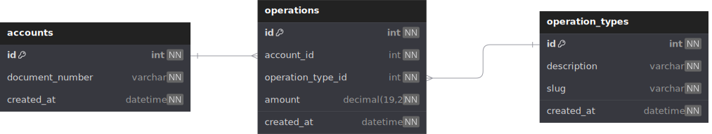
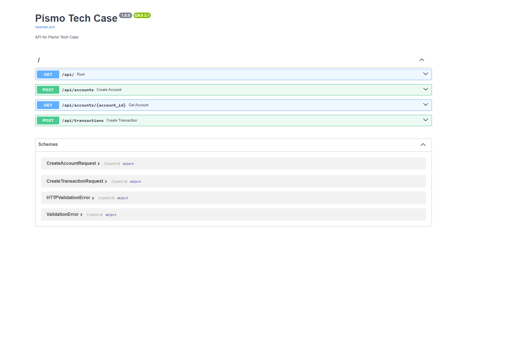

# Pismo Tech Case 

This repository contains a solution for the Pismo Tech Case, which involves creating a REST API to manage financial transactions. The API allows users to create accounts and record transactions for those accounts. The solution is built using Python, FastAPI, SQLAlchemy, and Alembic for database migrations.

## Makefile 
The project includes a Makefile to simplify common tasks such as running the application, running tests, and managing the database. The Makefile provides the following features:
- `make start`: Runs the FastAPI application using Uvicorn.
- `make test`: Runs the test suite using pytest.
- `make docker-build`: Builds the Docker container for the application.
- `make db_upgrade`: Applies database migrations using Alembic.
- `make db_downgrade`: Rolls back the database to the previous version using Alembic.
- `make db_console`: Opens a PostgreSQL console for the database.

These commands can be executed in the terminal to manage the application and its dependencies easily.

## Poetry 
The project uses Poetry for dependency management and packaging. Poetry simplifies the process of managing Python packages and their dependencies, ensuring that the application runs with the correct versions of libraries.
To install the dependencies, run the following command:

```bash
poetry install
```

But the docker container already has all the dependencies installed, so you can run the application without installing them manually.

## Docker 
The project includes a Dockerfile for containerization, allowing the application to run in a consistent environment. The Dockerfile sets up the necessary dependencies and configurations for the FastAPI application.
To build and run the Docker container, use the following commands:

```bash
make docker-build
```

But the project also runs on [dev-container](https://code.visualstudio.com/docs/devcontainers/containers) and you can use the following command to run it: 
```bash	
    devcontainer . 
```

## Database 
The project uses SQLite as the database for storing account and transaction data. The database schema is managed using Alembic, which allows for easy migrations and version control of the database structure.
The database diagram is the following: 




The database can be initialized and migrated using the following commands:

```bash
make db_upgrade
```

Also you can drop the database using 

```bash
make db_downgrade
```

## Testing 
The project includes a test suite to ensure the functionality of the API. The tests are written using pytest and cover various aspects of the application, including account creation, transaction recording, and error handling.
To run the tests, use the following command:

```bash
make test
```

## Documentation
The API docuementation is automatically generated by FastAPI and can be accessed at the following URL:

```
http://localhost:8080/docs
```



Just remember to run the application first using:

```bash
make start
```
